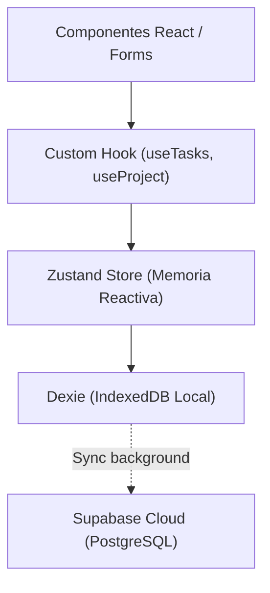

# Skill: Motor de Conocimiento del Dominio Autumn

Esta skill contiene el conocimiento técnico profundo y las invariantes del negocio de **Autumn**.

---

## 🧭 1. Entidades del Dominio

Las definiciones de TypeScript residen en `src/types/`:

1. **`Project`**: Contenedor principal de proyectos del portafolio.
2. **`Task`**: Unidad de trabajo. Propiedades críticas: `id`, `projectId`, `name`, `startDate`, `endDate`, `duration`, `progress`, `wbsCode`, `level`, `color`.
3. **`Dependency`**: Relación dirigida entre tareas (`fromTaskId` -> `toTaskId`). Tipos: `Finish-to-Start (FS)`, `Start-to-Start (SS)`, `Finish-to-Finish (FF)`, `Start-to-Finish (SF)`.
4. **`Milestone`**: Hito con fecha fija (`isCompleted`, `date`, `projectId`).
5. **`Resource` & `ResourceAssignment`**: Asignación de personal o recursos con porcentaje de dedicación y costo.
6. **`GlobalHoliday`**: Días no laborables globales que impactan en el cálculo de duración de tareas.

---

## ⚙️ 2. Motor de Cálculo de Fechas y Dependencias

Ubicación: `src/lib/calculations/` y `src/lib/algorithms/`.

### Algoritmo de Kahn (Ordenación Topológica)
- **Propósito:** Resolver el orden de propagación de fechas en cascada cuando una tarea predecesora se mueve.
- **Invariante Crítica:** Debe detectar ciclos de dependencias antes de recalcular fechas para evitar bucles infinitos o *Maximum call stack size exceeded*.
- **Cálculo de Días Hábiles:**
  - Las tareas por defecto consideran días laborables de Lunes a Viernes excluyendo `GlobalHolidays`.
  - La duración en días = número de días laborables entre `startDate` y `endDate`.

---

## 💾 3. Persistencia y Flujo de Datos (Local-First)

1. **Zustand (`src/hooks/`):** Estado en memoria reactivo e inmediato.
2. **Dexie (`src/lib/storage/db.ts`):** Base de datos IndexedDB local. Si se cambia la estructura de índices, DEBE añadirse una nueva versión en `migrations.ts`.
3. **Supabase (`src/lib/supabase/db_service.ts`):** Servicio de nube. Utilizado para autenticación de usuarios y persistencia remota.

---

## 🎨 4. Arquitectura de Componentes

1. **`src/components/ui/`**: Componentes reutilizables de UI (Button, Dialog, Dropdown, Input, etc.) construidos sobre Radix UI y Tailwind CSS. **Prohibido incluir lógica de negocio aquí.**
2. **`src/components/features/`**: Módulos funcionales de la aplicación:
   - `GanttChart`: Renderizado del diagrama de Gantt, timeline y barras de tareas.
   - `WBS`: Estructura de desglose de trabajo jerárquica con numeración automática (`1.1`, `1.1.1`).
   - `Milestones`: Gestión visual de hitos y fechas clave.
   - `Portfolio`: Visión agregada de múltiples proyectos.
   - `Resources`: Asignación y sobreasignación de recursos.
