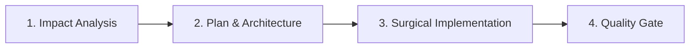

# Autumn - Project & Agent Guidelines

Este documento define el **protocolo operativo obligatorio**, las **invariantes de arquitectura** y la **definición de subagentes** para todo desarrollo en el repositorio **Autumn**.

---

## 🛡️ 1. Protocolo Obligatorio en 4 Fases

Ningún cambio sustancial en el código debe realizarse de forma improvisada. Todo agente debe seguir estrictamente este ciclo:

### Fase 1: Análisis de Impacto (`impact-analysis`)
- Antes de editar cualquier archivo, mapear el árbol de dependencias completo:
  - Tipos TypeScript (`src/types/`).
  - Stores de Zustand (`src/hooks/`).
  - Esquema y tablas de Dexie / IndexedDB (`src/lib/storage/`).
  - Servicios y clientes de Supabase (`src/lib/supabase/`).
  - Vistas UI afectadas (Gantt, WBS, Board, Milestones, Portfolio, Resources).
- Usar la skill `impact-analysis` para documentar la matriz de riesgos.

### Fase 2: Planificación y Validación de Arquitectura
- Para cambios que involucren más de 2 archivos o refactorizaciones, redactar el plan explícito.
- Para cambios arquitectónicos estructurales, invocar al subagente `architect-reviewer` (modelo `pro`) para validar la solución antes de tocar código.

### Fase 3: Implementación Quirúrgica
- Aplicar cambios mínimos necesarios respetando la arquitectura existente.
- Prohibida la sobreingeniería o refactorizaciones masivas no solicitadas.
- Mantener la integridad de comentarios, JSDoc y tipado estricto.

### Fase 4: Quality Gate Obligatorio (`quality-gate`)
Antes de dar por finalizada cualquier tarea, es **estrictamente obligatorio** ejecutar y superar:
1. `tsc -b` (Compilación TypeScript sin errores de tipos).
2. `npm run lint` (ESLint sin fallos ni advertencias graves).
3. `npm run test` (Suite de Vitest pasando al 100%).
4. Auditoría de diff con `qa-code-auditor` para detectar fugas de memoria o re-renders innecesarios.

---

## 🏛️ 2. Invariantes Críticas de Arquitectura y Dominio

1. **Cálculo de Fechas y Dependencias (Algoritmo de Kahn):**
   - El motor de cálculo en `src/lib/calculations/` y `src/lib/algorithms/` utiliza ordenación topológica para evitar bucles infinitos en grafos de dependencias de tareas.
   - **Regla:** Queda terminantemente prohibido alterar la lógica de detección de ciclos o cálculo de fechas sin ejecutar la suite de pruebas unitarias (`src/tests/dependencies.test.ts`, etc.) y añadir nuevos tests si se introduce una variante.

2. **Arquitectura Local-First (Dexie + IndexedDB):**
   - La aplicación es primordialmente local-first. Todas las operaciones CRUD deben reflejarse de forma reactiva en el store de Zustand y persistirse en Dexie.
   - Las migraciones de Dexie (`src/lib/storage/migrations.ts`) deben incrementar su versión de esquema si se añaden o modifican índices.

3. **Sincronización con Supabase (BaaS):**
   - Las operaciones de red hacia Supabase no deben bloquear la interfaz local del usuario.
   - La resolución de conflictos debe priorizar la integridad de los datos locales si la conexión es inestable.

4. **Separación de Componentes UI vs Feature:**
   - `src/components/ui/`: Componentes base agnósticos al dominio (shadcn/Radix). No deben importar stores de negocio ni lógica de Supabase/Dexie.
   - `src/components/features/`: Componentes de negocio (Gantt, WBS, etc.) que orquestan hooks y UI.

---

## 🤖 3. Subagentes Especializados del Proyecto

Cuando una tarea requiera verificación profunda, el agente principal puede definir e invocar estos subagentes con modelo `pro`:

### `architect-reviewer`
- **Rol:** Auditor de Arquitectura y Diseño.
- **Cuándo invocar:** Antes de aplicar cambios en esquemas de base de datos, reorganización de carpetas, nuevos contratos de sincronización o refactorizaciones de módulos centrales.
- **Salida esperada:** Evaluación de impacto, detección de acoplamientos indeseados y aprobación o ajustes al plan.

### `qa-code-auditor`
- **Rol:** Revisor de Código y Calidad (Senior Tech Lead).
- **Cuándo invocar:** Tras la implementación de cambios complejos.
- **Salida esperada:** Análisis línea a línea del diff buscando *race conditions*, fallos de tipado `any`, closures obsoletos en hooks y potenciales fugas de memoria.

### `test-engineer`
- **Rol:** Ingeniero de Automatización de Pruebas.
- **Cuándo invocar:** Para crear y ampliar suites de Vitest en `src/tests/`, cubriendo casos límite de cálculos de fechas, hooks y persistencia.
